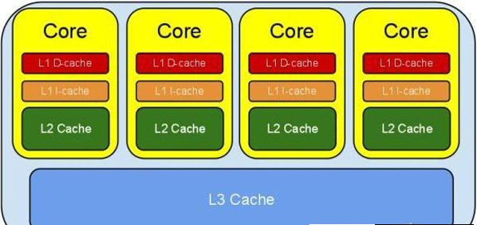

### Java内存模型Cookbook阅读笔记 参考链接：[并发编程网-JMM Cookbook](http://ifeve.com/jmm-cookbook/)

核心思想：说明了在最简单的背景下 **指令重排**、**内存屏障**、**多处理器**等规则在JVM中存在的原因。

*   #### [指令重排](http://ifeve.com/jmm-cookbook-reorderings/)
> 1. **什么是指令重排？**     
   > CPU和编译器为了提升并行处理的效率,会按照一定的规则进行指令优化。如果当前的指令序列是(a,b,c),
   指令执行速度 a < c < b，则CPU可以按照 b -> c -> a 顺序执行。
   若CPU是三核处理器，则handler-1可执行b,handler-2执行c,handler-3执行a,
   这样等到b,c都执行完毕的时候,a也正好执行完。相比 a -> b -> c 顺序，提高了CPU的执行效率。       
   CPU三级缓存示意图：            
   
> 2. **指令重排的问题**        
   > 如果代码的逻辑之间存在一定的先后顺序，在并行处理的时候就会产生二义性，不同的执行逻辑，得到不同的结果。
   在单线程执行时，这些指令不允许重排： 
         <table>
            <tr>
                <th>名称</th><th>代码</th>
            </tr>
            <tr>
                <td>先写后读</td>
                <td>a=1;b=a</td>
            </tr>
            <tr>
                <td>先写后写</td>
                <td>a=1;a=2</td>
            </tr>
            <tr>
                <td>先读后写</td>
                <td>a=b;b=1</td>
            </tr>
        </table>            
> 3. **JMM中禁止指令重排的规则**        
   > 主要有两种：对字段(包括数组中的元素)的存取指令(load,store)；对锁(lock)的控制指令。具体指令有：        
        <ul>
            <li>
                Normal Load：对非Volatile字段的读取，getField,getStatic,array load;   
            </li>
            <li>
                Normal Store：对非Volatile字段的存储，putField,putStatic,array store;   
            </li>
            <li>
                Volatile Load：对Volatile字段的读取，getField,getStatic;   
            </li>
            <li>
                Volatile Store：对Volatile字段的存储，putField,putStatic;   
            </li>
            <li>
                MonitorEnters：包括进入同步块Synchronized的方法
            </li>
            <li>
                MonitorExits：包括退出同步块Synchronized的方法
            </li>
        </ul>
        <table>
            <tr>
                <th>能否重排</th>
                <th colspan="3">第二个操作</th>
            </tr>
            <tr>
                <th>第一个操作</th>
                <th>Normal Load,Normal Store</th>
                <th>Volatile Load,MonitorEnter</th>
                <th>Volatile Store,MonitorExit</th>
            </tr>
            <tr>
                <td>Normal Load,Normal Store</td>
                <td></td>
                <td></td>
                <td>NO</td>
            </tr>
            <tr>
                <td>Volatile Load,MonitorEnter</td>
                <td>NO</td>
                <td>NO</td>
                <td>NO</td>
            </tr>
            <tr>
                <td>Volatile Store,MonitorExit</td>
                <td></td>
                <td>NO</td>
                <td>NO</td>
            </tr>
        </table>
    提示：上述关于Volitale,Monitor的规则仅仅适用于可能被多线程访问的变量和对象。如果一个编译器可以证明，一个
    锁只被单线程访问，那么这个锁就可以去掉。如果一个Volitale变量只被单线程访问，这个变量也可以被当作是普通变量。      
    不能被同一个内存地址上的load指令和之后紧跟着的store指令重排，但是可以被两个不同的内存地址上的load和store
    指令进行重排。
> 4. **Final字段的重排规则**       
   > Final字段的Load,Store指令重排规则和Volatile以及Lock的规则一样，但是有两点需要注意：       
    1.如果有一个Store指令（在构造函数中为一个Final字段赋值，同时这个字段是一个引用），如果后续的指令能够
     在构造函数外让持有这个Final字段的对象被其他线程访问的指令，那么当前的Store不能和该指令进行重排序。
      <p>
        x.finalField=v;     
        ....;       
        sharedRef=x;</span>     
        其中：x.finalField=v,在构造函数中操作
      </p>
    2.一个final字段的初始化Load指令不能与包含该字段的对象的初始化Loadzhi指令进行重排序
      <p>
       x = shareRef;        
       ....;        
       i = x.finalField;
      </p>  

*   #### [内存屏障 Memory Barriers](http://ifeve.com/jmm-cookbook-mb/)   
> 1. **什么是内存屏障？**
   > * 内存屏障也称为内存栅栏，屏障指令等，是一类同步屏障指令，是CPU或编译器在对内存随机访问的操作中的一个同步点,
   使得在此同步点之前的所有读写操作都执行后才开始执行此同步点之后的操作。常常用于内存之间的访问。 
> 2. **为什么需要内存屏障？**     
   > * 在单核处理器上不需要内存屏障保障"顺序执行"的结果一致性，因为其本身就能保证。      
   在多核处理器上需要使用内存屏障指令来确保"顺序执行"的结果一致性。
   > * 内存屏障指令只是直接控制CPU与其缓存之间，CPU与其准备写入主存、写入后等待读取、预测指令执行的缓冲中的写
   缓存之间的相互操作。
   > * 在JMM规范中，没有强制处理器之间的交互方式，只要数据最终变为全局可用，也就是说在所有处理器之间可见，并当
   这些数据可见时可以获取他们。
> 3. **内存屏障的种类？**    
   > * LoadLoad屏障       
   序列：Load1,LoadLoad1,Load2     
   确保Load1所要读入的数据能够在被Load2和后续的Load指令访问前读入。      
   通常在能够执行预加载指令或支持乱序处理的处理器中需要显示声明LoadLoad屏障，因为在这些处理器中正在等待的Load
   指令能够绕过正在等待的Store指令。      
   > * StoreStore屏障     
   序列：Store1,StoreStore,Store2      
   确保Store1的数据在Store2以及后续的Store指令操作相关数据之前对其他处理器可见(例如：向主内存刷新数据)。通常
   情况下，如果处理器不能保证从写缓存或缓存向其他处理器或主内存按照顺序刷新数据，那么它需要使用StoreStore屏障。     
   > * LoadStore屏障
   序列：Load1,LoadStore,Store2        
   确保Load1的数据在Store2和后续Store指令被刷新之前读取。在 Waiting Store指令可以越过Load指令的处理器桑需要使用
   LoadStore屏障。      
   > * StoreLoad屏障
   序列：Store1,StoreLoad,Load2        
   确保Store1的数据在被Load2以及后续的Load指令读取之前对其它处理器可见。
   通常它的开销是最昂贵的。因为它们必须通过关闭 略过缓存直接从写缓存读取数据 的机制。       
   下面是符合JSR-133的屏障的重排序规则：        
       <table>
            <tr>
                <th>需要的屏障</th>
                <th colspan="4">第二步</th>
            </tr>
            <tr>
                <td>第一步</td>
                <td>Normal Load</td>
                <td>Normal Store</td>
                <td>Volatile Load,Monitor Enter</td>
                <td>Volatile Store,Monitor Exit</td>
            </tr>
            <tr>
                <td>Normal Load</td>
                <td></td>
                <td></td>
                <td></td>
                <td>Load Store</td>
            </tr>
            <tr>
                <td>Normal Store</td>
                <td></td>
                <td></td>
                <td></td>
                <td>Store Store</td>
            </tr>
            <tr>
                <td>Volatile Load,Monitor Enter</td>
                <td>LoadLoad</td>
                <td>LoadStore</td>
                <td>LoadLoad</td>
                <td>LoadStore</td>
            </tr>
            <tr>
                <td>Volatile Store,Monitor Exit</td>
                <td></td>
                <td></td>
                <td>StoreLoad</td>
                <td>Store Store</td>
            </tr>
       </table>      
    另外，特殊的final字段规则，在下面代码中需要一个StoreStore屏障      
    <p>
        x.finalField = v;              
        StoreStore;          
        sharedRef = x;               
    </p>
    下面例子解释如何防止屏障：       

```
        class X {
            int a, b;
            volatile int v, u;
        
            void f() {
                int i, j;
        
                i = a;// load a
                j = b;// load b
                i = v;// load v
                // LoadLoad
                j = u;// load u
                // LoadStore
                a = i;// store a
                b = j;// store b
                // StoreStore
                v = i;// store v
                // StoreStore
                u = j;// store u
                // StoreLoad
                i = u;// load u
                // LoadLoad
                // LoadStore
                j = b;// load b
                a = i;// store a
            }
        }
 ```
 > 4. **数据依赖和屏障**           